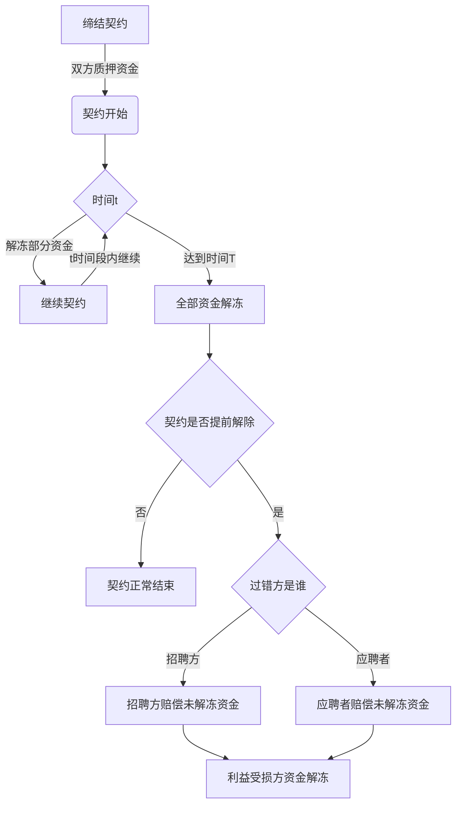

# Contract-Shield

```mermaid

    graph TD
        A[缔结契约] -->|双方质押资金| B(契约开始)
        B --> C{时间t}
        C -->|解冻部分资金| D[继续契约]
        D -->|t时间段内继续| C
        C -->|达到时间T| E[全部资金解冻]
        E --> F{契约是否提前解除}
        F -->|否| G[契约正常结束]
        F -->|是| H{过错方是谁}
        H -->|招聘方| I[招聘方赔偿未解冻资金]
        H -->|应聘者| J[应聘者赔偿未解冻资金]
        I --> K[利益受损方资金解冻]
        J --> K

```

Update：2025年4月23日存档
